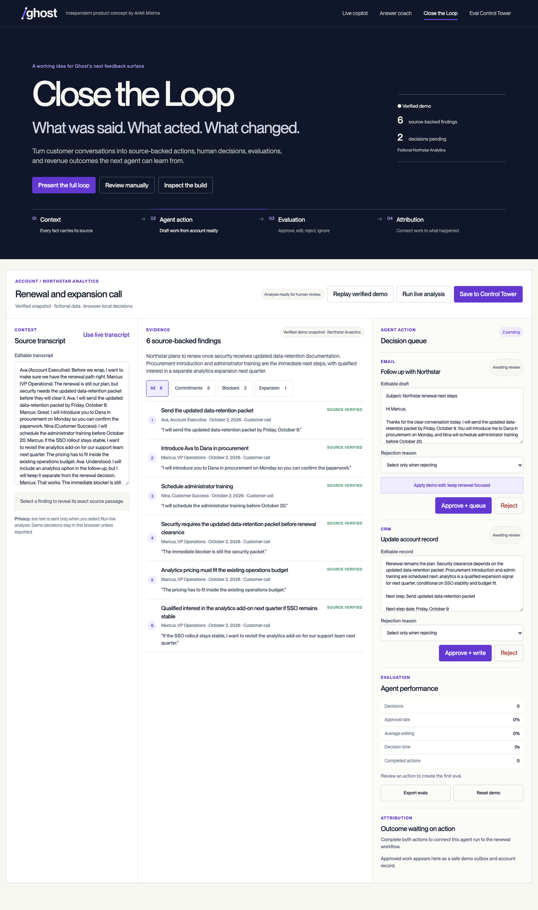

# Conversation Copilot

**A source-grounded copilot for live conversations and post-call follow-through.**

[Try the verified Close the Loop demo](https://conversation-copilot-three.vercel.app/?view=loop&demo=commitment-loop) · [Open Eval Control Tower](https://conversation-copilot-three.vercel.app/?view=evals) · [Open Live copilot](https://conversation-copilot-three.vercel.app/?view=live) · [Open Answer coach](https://conversation-copilot-three.vercel.app/?view=coach)

Conversation Copilot listens through your microphone, transcribes speech, and provides tactical coaching grounded in a configurable profile. After a call, **Close the Loop** converts the transcript into traceable commitments, an editable follow-up email, and a CRM update. Human approvals, edits, and rejections become evaluation data that can improve the next run.

This repository is an independent product concept by Ankit Mishra. The Ghost-branded interface demonstrates product and brand fluency; it is not an official Ghost product.



## Product tour

| Surface | What to look for | Direct link |
| --- | --- | --- |
| **Verified Close the Loop demo** | An eight-step, deterministic walkthrough from transcript evidence to a corrected follow-up, structured evaluation event, scoped learned rule, and associated fictional outcome. | [Open demo](https://conversation-copilot-three.vercel.app/?view=loop&demo=commitment-loop) |
| **Eval Control Tower** | Durable run history, approval and edit rates, rejection reasons, decision latency, evidence quality, and rule-attribution comparisons. | [Open dashboard](https://conversation-copilot-three.vercel.app/?view=evals) |
| **Live copilot** | Microphone capture, rolling transcript, translation, tactical prompts, and a compact desktop overlay option. | [Open live mode](https://conversation-copilot-three.vercel.app/?view=live) |
| **Answer coach** | A structured answer, relevant proof points, suggested questions, and watch-outs generated from the current conversation context. | [Open coach](https://conversation-copilot-three.vercel.app/?view=coach) |

The hosted demo is the fastest way to review the product. The deterministic Close the Loop replay works without microphone access, a database, or an AI Gateway credential. Live transcription and model-generated analysis require the services described in [Local setup](#local-setup).

## What it demonstrates

| Mode | Purpose |
| --- | --- |
| **Live copilot** | Transcribes a conversation, translates when needed, and suggests what to say next. |
| **Answer coach** | Turns the current conversation into a concise answer, proof points, questions, and watch-outs. |
| **Close the Loop** | Extracts source-backed actions and risks, prepares follow-up artifacts, records human decisions, and traces those decisions into a later run. |
| **Eval Control Tower** | Persists explicitly saved runs and shows approval, editing, decision-time, evidence-quality, rejection-reason, and learned-rule analytics. |

Each mode has a shareable URL: `?view=live`, `?view=coach`, `?view=loop`, or `?view=evals`.

## Why this product

The prototype responds to Ghost's AI Builder brief with a narrow end-to-end workflow: turn a customer conversation into work that is grounded, reviewed, completed, measured, and improved. It demonstrates the full loop described in the brief:

```text
Context → Agent action → Human evaluation → Learned guidance → Attribution
```

The central product bet is that the human decision is not merely a UI event. An approval, edit, rejection, or ignored draft becomes structured evaluation data tied to the account, source evidence, artifact, agent run, and eventual outcome. That gives Ghost a path from useful daily workflow to a proprietary quality and trust layer.

The current build deliberately keeps CRM and email actions inside a labelled sandbox. Production integration would use Ghost's governed write layer while preserving the CRM as the revenue system of record.

## Design principles

1. **Evidence before automation.** Every extracted commitment, blocker, or opportunity carries an exact transcript quote. Unsupported evidence is marked rather than silently accepted.
2. **Human decisions are product data.** Approval, editing, rejection, and decision time are recorded as typed evaluation events, not flattened into a generic success metric.
3. **Learning is scoped.** A correction becomes reusable guidance only for its declared account, artifact, or scenario scope. A customer-email preference does not silently rewrite CRM memory.
4. **Attribution stays honest.** The verified replay demonstrates association between a rule and a later result. It does not claim that the agent caused the commercial outcome.
5. **Persistence requires consent.** The browser keeps an offline-safe local ledger. A transcript reaches the durable Control Tower only after the user selects **Save to Control Tower**.
6. **System-of-record boundaries remain visible.** Email and CRM actions are explicitly labelled as sandbox operations in this prototype.

## Try the verified demo

Open the [Close the Loop demo](https://conversation-copilot-three.vercel.app/?view=loop&demo=commitment-loop), then select **Present the full loop**.

The deterministic eight-step replay follows one customer claim through:

1. transcript evidence and exact source attribution;
2. a human edit to the proposed customer email;
3. approval and a browser-local evaluation event;
4. a scoped rule derived from the correction;
5. a second run shown with and without that rule; and
6. a clearly labelled fictional downstream outcome.

The demo uses the bundled fixture in [`data/commitment-loop-demo.json`](data/commitment-loop-demo.json). It does not require an API key or depend on model availability. **Run live analysis** is a separate path.

### What the replay proves

The replay intentionally separates deterministic product behavior from probabilistic model behavior:

| Step | Product behavior | Stored or derived output |
| --- | --- | --- |
| 1. Load context | Select a known account conversation and scenario. | Transcript and scenario metadata |
| 2. Extract work | Identify commitments, blockers, risks, and expansion signals. | Evidence items with exact source quotes |
| 3. Draft actions | Prepare a customer follow-up and CRM update. | Reviewable artifacts linked to the run |
| 4. Human correction | Edit, approve, or reject each artifact. | Evaluation event, edit ratio, reason, and decision time |
| 5. Learn guidance | Convert the correction into a narrow rule. | Rule text, scope, exclusions, and provenance |
| 6. Compare next run | Show output with and without the rule applied. | Rule-application record and comparison |
| 7. Inspect attribution | Associate the evaluated work with a labelled fictional outcome. | Trace from outcome back to run and evidence |
| 8. Review metrics | Aggregate the events in the Control Tower. | Quality, trust, friction, and evidence metrics |

## How it works

```text
Microphone or transcript
          |
          v
  Speech-to-text API ------> Scenario profile and private memory
          |                              |
          +--------------+---------------+
                         v
             Translation and coaching
                         |
                         v
              Source-backed extraction
                         |
             +-----------+-----------+
             v                       v
      Follow-up email             CRM update
             +-----------+-----------+
                         v
             Human approve/edit/reject
                         |
                         v
        Local evaluation ledger and learned rule
```

The durable path adds a server-side data layer:

```text
Browser workflow
  ├─ transcript + exact source quotes
  ├─ editable follow-up and CRM artifacts
  └─ approve / edit / reject decisions
                 |
                 v
Vercel Functions: validation, idempotency, access boundary
                 |
                 v
Supabase Postgres
  ├─ conversations → agent_runs → artifacts
  ├─ evidence_items
  ├─ evaluation_events
  └─ learned_rules ↔ rule_applications
                 |
                 v
Eval Control Tower: quality, trust, friction, and traceability
```

The browser is a plain HTML, CSS, and JavaScript client. Vercel Functions provide the profile, transcription, coaching, close-loop, persistence, and analytics APIs. Model calls go through Vercel AI Gateway. The local evaluation ledger remains the offline-safe working copy; an explicit **Save to Control Tower** action persists the consented transcript, artifacts, source evidence, and decisions to Supabase.

### Runtime boundaries

| Layer | Responsibility | Sensitive data handling |
| --- | --- | --- |
| Browser client | Capture, mode navigation, artifact review, local ledger, presentation replay, and dashboard rendering. | Receives a redacted profile; retains unsaved evaluations locally. |
| Vercel Functions | Access checks, validation, model orchestration, evidence verification, persistence, analytics, and deletion. | Keeps private profile fields and service credentials server-side. |
| Vercel AI Gateway | Speech-to-text, translation, coaching, snapshots, and Close the Loop analysis. | Invoked only for an explicit AI action or active listening session. |
| Supabase Postgres | Durable conversations, runs, artifacts, evidence, evaluation events, learned rules, and applications. | Accessed with a server-only secret; browser clients do not query tables directly. |
| Private memory repository | Optional source for `data/profile.json` during deployment. | Read by the deployment sync script, never exposed directly to the client. |

## Local setup

### Prerequisites

- Node.js 22 or later
- npm
- A Vercel account for live API routes and deployment
- An AI Gateway credential for local model calls, or Vercel OIDC in a deployment

### Choose a development mode

| Goal | Command | Services required |
| --- | --- | --- |
| Review the deterministic demo | `python3 -m http.server 4174` | None |
| Exercise API routes locally | `npx vercel dev` | AI Gateway for AI features; Supabase for durable evals |
| Capture from the terminal | `npm run listen -- --role renewal-call --save` | A running local or deployed API |
| Use the desktop overlay | `npm run desktop` | Installed dependencies and a running/deployed API |
| Run validation only | `npm run check && npm test` | None |

Clone and install:

```bash
git clone https://github.com/ankitmishra01/conversation-copilot.git
cd conversation-copilot
npm install
cp data/profile.example.json data/profile.json
cp .env.example .env.local
```

For the verified static demo, run:

```bash
python3 -m http.server 4174
```

Then open:

```text
http://localhost:4174/?view=loop&demo=commitment-loop
```

For live API routes, add `AI_GATEWAY_API_KEY` to `.env.local` and run:

```bash
npx vercel dev
```

Open `http://localhost:3000`. Microphone access requires `localhost` or HTTPS.

### Supabase setup for the Control Tower

The deterministic demo and browser-local ledger do not require Supabase. To persist runs and use the Control Tower with live data:

1. Create or connect a Supabase project.
2. Apply [`supabase/migrations/20261004022209_create_eval_control_tower.sql`](supabase/migrations/20261004022209_create_eval_control_tower.sql).
3. Apply [`supabase/migrations/20261004022943_lock_down_rls_auto_enable.sql`](supabase/migrations/20261004022943_lock_down_rls_auto_enable.sql).
4. Optionally load [`supabase/seed.sql`](supabase/seed.sql) for labelled demo data.
5. Set `SUPABASE_URL` and `SUPABASE_SECRET_KEY` in `.env.local` or the Vercel project environment.

The schema enables row-level security and revokes direct access from public roles. All reads and writes in this prototype pass through server-side functions.

## Configure the copilot

Personal configuration belongs in `data/profile.json`, which is git-ignored. Start from [`data/profile.example.json`](data/profile.example.json).

```jsonc
{
  "you": {
    "name": "Your Name",
    "role": "account executive",
    "positioning": "The context the copilot should use when coaching you.",
    "background": [
      {
        "label": "Company or role",
        "proofPoints": ["A claim the copilot may safely use."],
        "usefulFor": ["all"]
      }
    ]
  },
  "scenarios": {
    "renewal-call": {
      "label": "Renewal call",
      "goal": "Leave with owners, dates, and the renewal blocker confirmed.",
      "language": { "source": "en", "target": "en" },
      "domainVocabulary": ["renewal", "data retention", "SSO"],
      "fitSummary": "How to position your value.",
      "proofBank": ["Short, quotable proof points."],
      "honestGap": "A gap to acknowledge and how to bridge it.",
      "questionsToAsk": ["What still blocks security approval?"],
      "settledAnswers": ["Facts to state literally."],
      "neverSay": ["Claims the copilot must not make."],
      "watchOuts": []
    }
  }
}
```

When `language.source` and `language.target` match, the app runs in notes mode. Different languages enable translation.

The browser receives only a redacted profile from `/api/profile`. Sensitive coaching fields such as `settledAnswers`, `neverSay`, `honestGap`, and `watchOuts` remain server-side.

## Environment variables

| Variable | Required | Purpose |
| --- | --- | --- |
| `AI_GATEWAY_API_KEY` | Local AI use | Authenticates AI Gateway requests. Vercel OIDC can supply deployment authentication instead. |
| `COPILOT_KEY` | No | Protects API access with a shared secret. Visit once with `?k=<value>` to store it locally. |
| `COPILOT_URL` | CLI only | Base URL used by the listener and credit scripts. Defaults to `http://localhost:3000`. |
| `COPILOT_ACTIVE_UNTIL` | No | ISO timestamp after which AI routes stop responding. |
| `COPILOT_RECALL` | No | Set to `enabled` to reopen an expired access window. |
| `COPILOT_RESERVE_USD` | No | Preserves a minimum AI Gateway credit balance. |
| `COPILOT_RESERVE_UNTIL` | No | ISO timestamp that bounds the credit reserve. |
| `MEMORY_REPO` | No | Private GitHub repository containing a profile file. |
| `MEMORY_PATH` | No | Profile path inside `MEMORY_REPO`; defaults to `profile.json`. |
| `AI_GATEWAY_MODEL` | No | Overrides the main translation and coaching model. |
| `AI_GATEWAY_FAST_MODEL` | No | Overrides the low-latency translation model. |
| `AI_GATEWAY_FALLBACK_MODEL` | No | Overrides the configured fallback model. |
| `AI_GATEWAY_STT_MODEL` | No | Overrides the speech-to-text model chain. |
| `AI_GATEWAY_LOOP_MODEL` | No | Overrides the Close the Loop analysis model. |
| `SUPABASE_URL` | Control Tower | Hosted Supabase project URL used only by Vercel Functions. |
| `SUPABASE_SECRET_KEY` | Control Tower | Server-only Supabase secret; never expose it to browser code. |

See [`.env.example`](.env.example) for a copy-ready configuration.

### Access control and expiry behavior

When `COPILOT_KEY` is set, API callers must send the key through the app. Visiting `?k=<value>` stores it in browser local storage and removes the need to keep the secret in shared URLs. CLI requests use the same access boundary.

`COPILOT_ACTIVE_UNTIL` can close the model-backed routes after a fixed time. `COPILOT_RECALL=enabled` reopens them without changing the timestamp. The reserve variables add a second guard so a live demo does not consume the last portion of an AI Gateway balance.

## Terminal listener

For more reliable capture than browser speech recognition, use the terminal listener:

```bash
npm run listen -- --role renewal-call --save
```

Set `COPILOT_URL` to a deployed URL or run `vercel dev` locally. The listener records through the same `/api/transcribe` and `/api/translate` routes as the web client. `--save` writes a local Markdown transcript under `transcripts/`.

The listener queues audio chunks, retries rate-limited transcription requests for roughly 45 seconds, and merges adjacent chunks when the queue grows. This favors retaining speech over producing the lowest possible latency during a provider throttle.

## Trust and privacy boundaries

- Extracted commitments, blockers, and expansion signals keep an exact source quote. Quotes missing from the transcript are marked unsupported.
- A transcript is sent to a model only when the user invokes an AI action such as **Run live analysis**.
- Evaluation events remain in browser storage unless the user explicitly saves the run to the Control Tower.
- Saved runs can be deleted with their transcript, artifacts, evidence, and decisions in one cascaded operation.
- Email and CRM completion occur only in a labelled demo sandbox. The interface does not claim to contact a customer or write to a real CRM.
- Profile fields that contain private strategy stay on the server and are omitted from the public browser payload.
- The app listens through the microphone. It does not join calls, control meeting software, or bypass participant consent.

## Commands

```bash
npm test          # run the complete Node test suite
npm run check     # syntax-check client, API, CLI, and desktop files
npm run listen    # start the terminal listener
npm run credits   # inspect AI Gateway balance and model configuration
npm run desktop   # open the Electron overlay
npm run deploy    # sync private profile data, then deploy to production
```

## API routes

| Route | Method | Role |
| --- | --- | --- |
| `/api/profile` | `GET` | Returns the public-safe profile and scenario list. |
| `/api/transcribe` | `POST` | Transcribes base64 audio and filters common silence hallucinations. |
| `/api/translate` | `POST` | Handles translation, answer generation, coaching, profile snapshots, and credit checks. |
| `/api/close-loop` | `POST` | Converts a transcript into verified evidence, a follow-up draft, and a CRM update. |
| `/api/runs` | `POST`, `DELETE` | Explicitly persists or deletes a transcript-backed agent run. |
| `/api/evaluations` | `POST` | Idempotently persists a server-validated human decision. |
| `/api/eval-dashboard` | `GET` | Returns filtered evaluation metrics and traceable recent runs. |

All routes honor the optional access key. AI routes also honor the access window and credit reserve.

### Representative API contracts

Generate source-backed post-call work:

```bash
curl -X POST http://localhost:3000/api/close-loop \
  -H 'content-type: application/json' \
  -d '{
    "accountName": "Example account",
    "scenario": "renewal-call",
    "transcript": "Customer: Security approval is blocked until the retention answer arrives Friday."
  }'
```

The response contains normalized evidence, warnings for unsupported quotes, a follow-up draft, and a CRM artifact. Transcripts are capped at 20,000 characters.

Persist an explicitly consented run:

```bash
curl -X POST http://localhost:3000/api/runs \
  -H 'content-type: application/json' \
  -d '{
    "idempotencyKey": "conversation:example-run",
    "accountName": "Example account",
    "scenario": "renewal-call",
    "transcript": "Customer: Security approval is blocked until Friday.",
    "analysis": {
      "summary": "Security answer is the renewal blocker.",
      "commitments": [],
      "blockers": [],
      "risks": [],
      "expansionSignals": [],
      "followUpEmail": {},
      "crmUpdate": {}
    }
  }'
```

Write operations use idempotency keys so a retry does not create duplicate conversations, runs, or evaluation events. Rejected evaluations require a non-empty reason. Deleting a saved run cascades through its transcript, artifacts, evidence, and decisions.

### Persistence model

```text
conversations
    └── agent_runs
          ├── artifacts
          │     └── evaluation_events
          ├── evidence_items
          └── rule_applications ── learned_rules
```

- `conversations` holds the consented transcript, account, scenario, and dataset label.
- `agent_runs` records model/run metadata, summaries, warnings, and creation time.
- `artifacts` stores the proposed customer email and CRM update.
- `evidence_items` preserves the normalized claim and exact source quote used to support it.
- `evaluation_events` stores approval, editing, rejection, reason, timing, edit ratio, and applied-rule identifiers.
- `learned_rules` stores reusable guidance with scope and exclusions.
- `rule_applications` joins a rule to the later run where it was applied.

## Repository map

```text
api/                         Vercel Functions and shared server-side profile/access logic
data/                        Example profile and deterministic Close the Loop fixture
supabase/                    Reproducible schema migrations and labelled demo seed data
desktop/                     Electron overlay wrapper
scripts/                     Terminal listener, profile sync, and credit utilities
test/                        Unit and integration-style Node tests
app.js                       Live copilot and answer coach client
close-loop.js                Post-call workflow and presentation replay
eval-ledger.js               Local decision events and evaluation metrics
eval-dashboard.js            Durable Control Tower client and source-trace rendering
view-controller.js           Shareable product-mode routing
index.html / styles.css       Product shell and Ghost-inspired visual system
DESIGN.md                    Design direction, interaction rules, and accessibility constraints
```

## Testing strategy

The test runner uses Node's built-in assertions and deliberately avoids requiring live provider credentials. The suite covers:

- access-key, expiry-window, and recall behavior;
- public/private profile boundaries and the profile endpoint;
- translation, transcription, memory loading, and deterministic fallback behavior;
- Close the Loop evidence normalization, quote verification, and UI states;
- local evaluation-ledger semantics, including mandatory rejection reasons;
- persistence validation, idempotency, dashboard aggregation, and cascade-delete expectations;
- Supabase schema protections and migration invariants;
- shareable mode routing and the verified presentation flow.

Run both gates before committing:

```bash
npm run check
npm test
```

`npm run check` parses every browser, API, CLI, and desktop JavaScript entry point. `npm test` executes the complete unit and integration-style suite through [`test/run.js`](test/run.js).

## Test and deploy

Run the quality gates before deploying:

```bash
npm run check
npm test
```

Deploy to Vercel:

```bash
vercel --prod
```

The production deployment needs HTTPS for microphone access and a serverless runtime for `/api/*`.

### Deployment checklist

1. Run `npm run check` and `npm test`.
2. Confirm `data/profile.json` is present locally or configure `MEMORY_REPO` and `MEMORY_PATH`.
3. Configure AI Gateway and Supabase credentials in the Vercel project environment.
4. Configure optional access, expiry, and credit-reserve variables.
5. Run `npm run deploy`, which syncs private profile data before invoking `vercel --prod`.
6. Open all four shareable views and verify the access boundary, microphone permission, live analysis, explicit save, dashboard refresh, and delete flow.

## Troubleshooting

| Symptom | Likely cause | Resolution |
| --- | --- | --- |
| Verified replay does not load | The site was opened without the demo query or an old asset is cached. | Open `?view=loop&demo=commitment-loop`, then hard refresh. |
| Microphone button does nothing | The page is not on HTTPS/localhost or permission was denied. | Use the deployed HTTPS URL or `localhost`, then re-enable microphone permission. |
| Other participant is missing from the transcript | Browser microphone capture does not automatically include system audio. | Use speakers or a loopback device such as BlackHole with the terminal listener. |
| AI action returns an access error | `COPILOT_KEY` is configured but not stored by this browser. | Visit once with `?k=<value>` or provide the key to the CLI. |
| AI action reports an expired window | `COPILOT_ACTIVE_UNTIL` is in the past. | Set a later timestamp or enable `COPILOT_RECALL`. |
| AI action falls back or reports gateway failure | Gateway authentication, model availability, rate limits, or credit reserve blocked the request. | Check `AI_GATEWAY_API_KEY`, run `npm run credits`, and inspect the model override variables. |
| Save to Control Tower fails | Supabase credentials or migrations are missing. | Verify both server-side variables and apply the two migrations in order. |
| Dashboard is empty | No live run was explicitly saved, or filters exclude it. | Save a run from Close the Loop and clear the dashboard filters. |
| A rejection cannot be submitted | Rejections require structured feedback. | Choose or enter a rejection reason before submitting. |
| Desktop or listener points at the wrong environment | `COPILOT_URL` is unset or stale. | Set it to `http://localhost:3000` or the current deployed URL. |

## Interview deck

[`docs/GENSPARK_DECK_PROMPT.md`](docs/GENSPARK_DECK_PROMPT.md) contains a detailed, source-grounded prompt for generating the CEO presentation in Genspark. It specifies the narrative, slide-by-slide content, architecture diagrams, visual system, speaker notes, and accuracy guardrails.

[`docs/ASSET_GUIDE.md`](docs/ASSET_GUIDE.md) provides direct GitHub links to the Ghost wordmark and high-resolution product screenshots, plus the exact palette, typography fallbacks, usage rules, and claim boundaries Genspark should follow.

## Limitations

Browsers cannot silently capture all system audio. Play the other participant through speakers or use a loopback device such as BlackHole with the terminal listener. A shared microphone cannot reliably distinguish your voice from the other participant, so the interface includes **Pause my voice** and **Resume incoming** controls.

The bundled Close the Loop replay is a fictional, deterministic product demonstration. It shows the mechanics of evidence, evaluation, learned guidance, and attribution without claiming that the agent caused a real commercial outcome.
